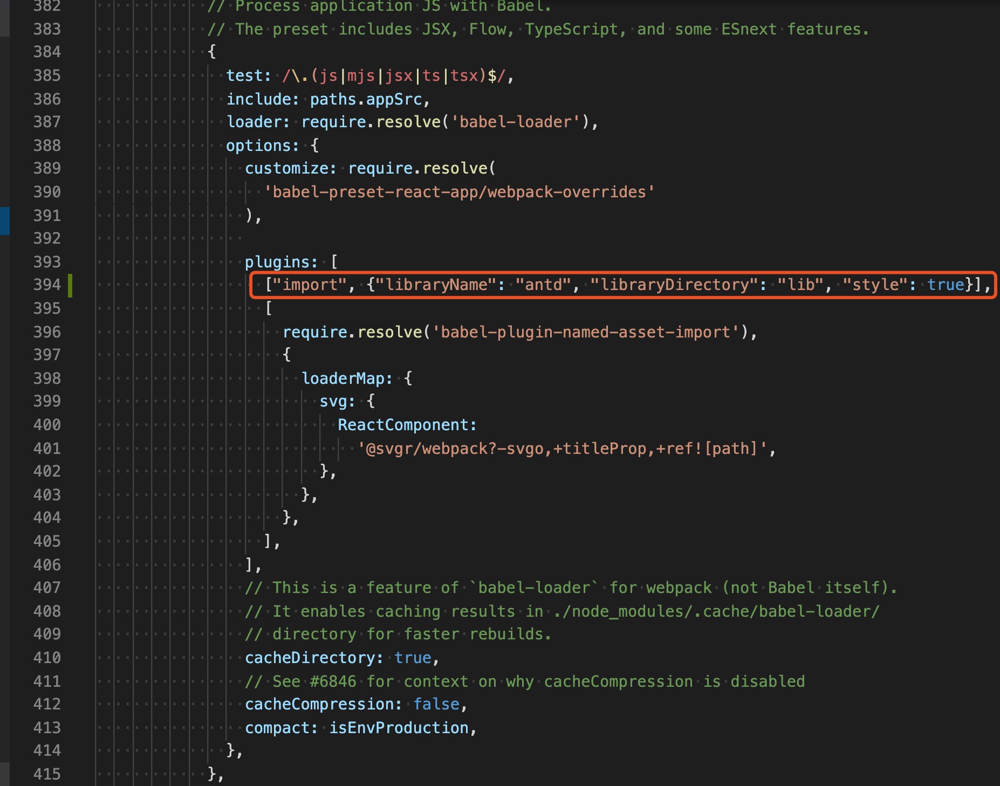
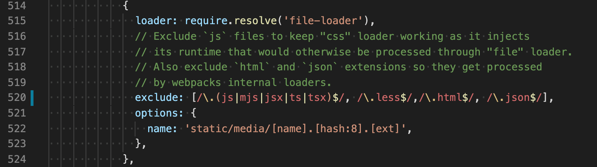
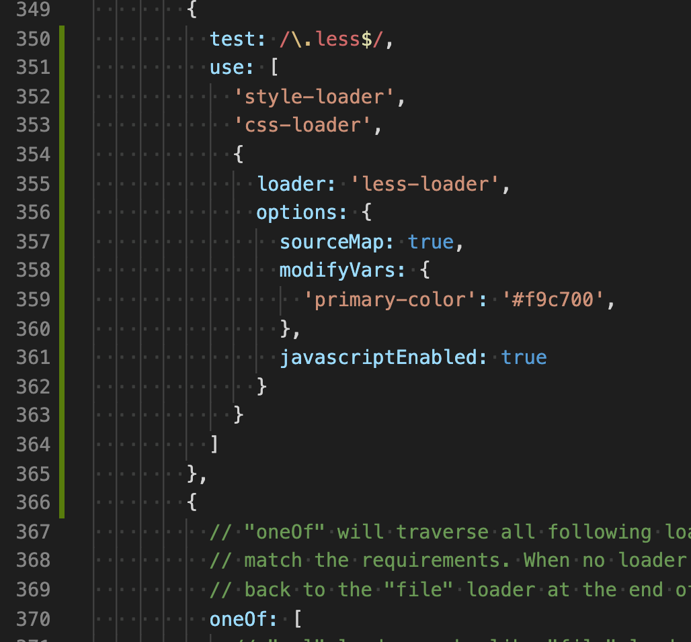

# 引入antd并自定义主题

> 2019年12月28日

1. 暴露webpack.config.js

`yarn eject`

2. 安装所需依赖

`yarn add antd less less-loader babel-plugin-import`

3. 打开webpack.config.js
	- 添加代码`["import", {"libraryName": "antd", "libraryDirectory": "lib", "style": true}],`， 如图
		
	- 添加代码`/\.less$/`， 如图
		
	- 在`oneof`上添加代码， 如图
		
	- 其他主题色参考[antd官网](https://ant.design/docs/react/customize-theme-cn)
4. 至此配置完成

 