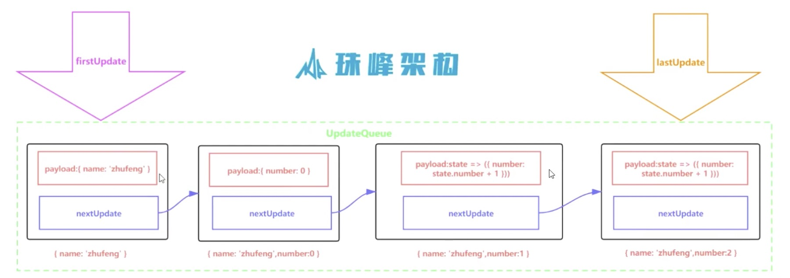

# react-hooks

教程 bilibili https://www.bilibili.com/video/BV16V411672B?p=1

# 1 预备知识

## 1.1 屏幕刷新率

+ 显示器刷新率大多为60Hz（即每秒刷新60次，一次约为16.6ms，根据显示器的刷新率不同会不一样），
+ 浏览器渲染动画或页面的每一贞的速率也需要和设备屏幕的刷新率保持一致
+ 页面是一贞一贞绘制出来的，当每秒绘制的贞数（FPS）达到60及以上时， 页面的动画是流畅的， 小于这个值用户会感觉到卡顿（俗称丢帧/掉贞）
+ 每一贞的预算时间的16.6毫秒（1秒60次）
+ 所以写代码时，力求不让一贞的工作量大于60ms

## 1.2 贞

+ 每贞的开头包括样式计算、布局、和绘制
+ js的执行和页面渲染在同一个线程，所以执行j和GUI渲染无法同时执行
  > 1. 渲染引擎即我们平时说的浏览器内核 
    Firefox： Gecko引擎   
    Safari： WebKit引擎  
    Chrome：Blink引擎  
    IE:  Trident引擎  
    Edge:  EdgeHTML引擎  
  > 2. GUI 的意思是图形用户界面
+ 如果某个js任务执行时间过长，浏览器会推迟渲染


### 1.2.1 requestAnimationFrame 请求动画贞（rAF）

rAf MDN:告诉浏览器——你希望执行一个动画，并且要求浏览器在下次重绘之前调用指定的回调函数更新动画。该方法需要传入一个回调函数作为参数，该回调函数会在浏览器下一次重绘之前执行, 这个函数还可以接受一个参数，它表示rFA开始执行这个回调函数的时刻。返回值是一个 long 整数，请求 ID ，是回调列表中唯一的标识。是个非零值，没别的意义。你可以传这个值给 window.cancelAnimationFrame() 以取消回调函数(实验中)。


```js
window.requestAnimationFrame(function(timestamp) {
  // do something
})
```

[dome](./docs/1.raf.html)

### 1.2.2 requestIdleCallback

这个方法能够在一贞的时间内（此时已经渲染完毕），如果还有空闲时间，则就执行这个方法，如果没有就不执行，比如一贞16.6ms，执行计算、渲染等工作用了10ms，那么就会将剩余时间分配给这个方法，如果没有,则不执行。

通俗来讲，即我告诉浏览器要执行一个函数，但是这个函数优先级最低，可以在空闲的时候执行，但是如果规定之间到了还没有执行，那么就要立即执行了。

第一个参数是需要执行的函数，第二个参数的意思xx毫秒后，无论浏览器是否空闲，立即执行第一个参数的函数。

```js
function slep (delay) {
  // js引擎会一直卡在这里 直到循环结束 这是一个20ms内的死循环
  for(let cur = Date.now(); Date.now() - cur < delay;) {}
}
const works = [
  () => {
    console.log('work1 start')
    slep(20)    // 因为这个任务的执行超过了16.6ms，即一贞的时候，所以浏览器会放弃执行
    console.log('work1 end')
  },
  () => {
    console.log('work2 start')
    slep(20)
    console.log('work2 end')
  },
  () => {
    console.log('work3 start')
    slep(20)
    console.log('work3 end')
  },
]
function runFirstWork() {
  // 每次将第一个取出 并执行
  works.shift()()
}
// 循环递归调用
function workLoop (deadline) {
  console.log('本贞剩余可用时间' + deadline.timeRemaining())
  // deadline.timeRemaining()  返回当前贞还剩下多少时间可以分配
  // deadline.didTimeout 表示此callback是否超时
  while((deadline.timeRemaining() > 0 || deadline.didTimeout) && works.length > 0) {
    // 如果当前贞剩余时间大于0 或者 已经超时
    runFirstWork()
  }
  // 跳出循环 说明当前贞没有剩余时间了，就需要放弃执行任务的控制权， 将控制权交还给浏览器
  console.log('没有剩余时间来')
  // 如果还有剩余任务，在此调用， 告诉浏览器空余时，来执行任务
  if(works.length) window.requestIdleCallback(workLoop, {timeout: 1000})
}
window.requestIdleCallback(workLoop, {timeout: 1000})
```

一些低优先级的任务可使用 requestIdleCallback 等浏览器不忙的时候来执行，同时因为时间有限，它所执行的任务应该尽量是能够量化，细分的微任务（micro task）。

因为它发生在一帧的最后，此时页面布局已经完成，所以不建议在 requestIdleCallback 里再操作 DOM，这样会导致页面再次重绘。DOM 操作建议在 rAF 中进行。同时，操作 DOM 所需要的耗时是不确定的，因为会导致重新计算布局和视图的绘制，所以这类操作不具备可预测性。

Promise 也不建议在这里面进行，因为 Promise 的回调属性 Event loop 中优先级较高的一种微任务，会在 requestIdleCallback 结束时立即执行，不管此时是否还有富余的时间，这样有很大可能会让一帧超过 16 ms。

[demo](./2.requestIdleCallback.html)

### 1.2.3 单链表

+ 单链表是一种链式存取的数据结构
+ 链表中的数据以节点来表示，每个节点由元素+指针， 元素是存储数据的存储单元，指针指向后续元素的存储位置
+ 在Fiber中，很多地方都用到链表



```js
class Update {
  constructor(payload, nextUpdate) {
    this.payload = payload
    this.nextUpdate = nextUpdate
  }
}
class UpdateQuene {
  constructor() {
    this.baseState = null
    this.firstUpdate = null
    this.lastUpdate = null
  }
  addUpdate(update) {
    if(this.firstUpdate === null) {
      this.firstUpdate = this.lastUpdate = update
    }else {
      this.lastUpdate.nextUpdate = update   // 上一个节点的nextUpdate 指向新增节点
      this.lastUpdate = update    // 修改最后节点为 新增节点
    }
  }
  forceUpdate() {
    let curState = this.baseState || {}
    let curUpdate = this.firstUpdate
    while(curUpdate) {
      const nextState = typeof curUpdate.payload === 'function' ? curUpdate.payload(curState) : curUpdate.payload
      curState = {...curState, ...nextState}  // 更新curState
      curUpdate = curUpdate.nextUpdate   // 更新curUpdate 为下一个节点，当curUpdate为null时，停止循环
    }
    this.firstUpdate = this.lastUpdate = null   // 循环结束，清空列表
    this.baseState = curState   // 将最新的curState 赋值给 baseState
    return curState
  }
}

let quene = new UpdateQuene()
quene.addUpdate(new Update({name: 'a'}))
quene.addUpdate(new Update({number: 1}))
quene.addUpdate(new Update(state => ({number: state.number+1})))
quene.addUpdate(new Update(state => ({number: state.number+1})))
const state = quene.forceUpdate()   // state = { name: 'a', number: 3 }
```